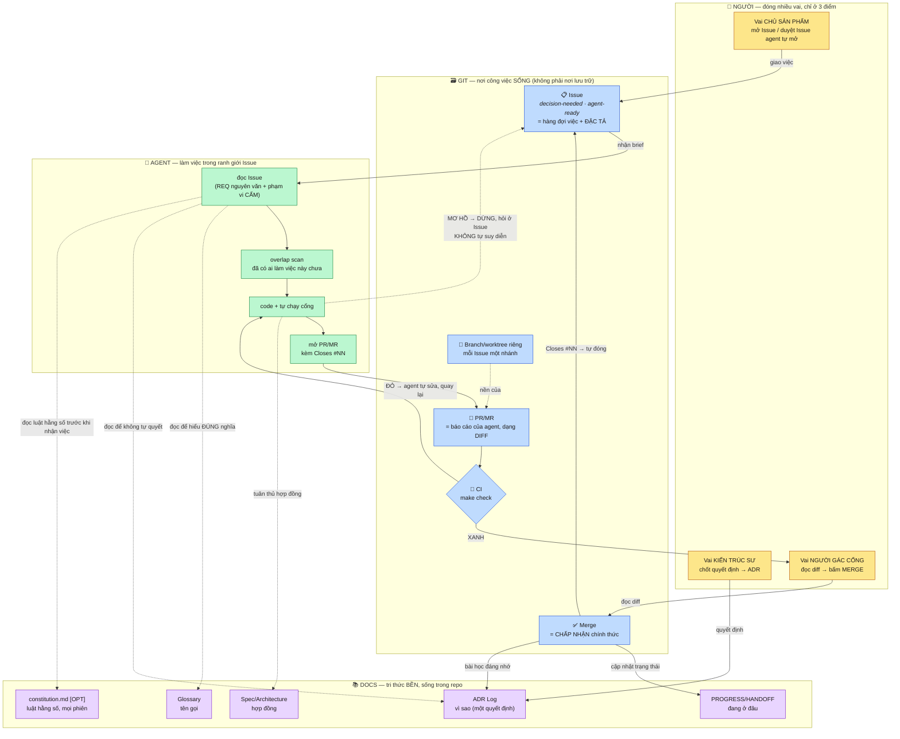
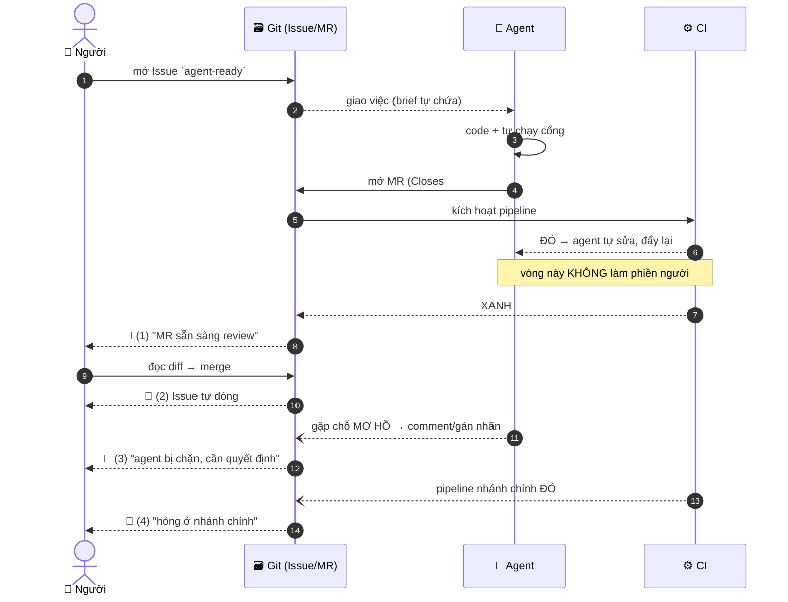

# CLAUDE.md — Cách dựng bộ TÀI LIỆU cho một project (playbook mang đi được)

> **File này là gì:** phương pháp luận viết tài liệu, **không gắn với một project cụ thể**. Chép nguyên
> file này sang repo mới, thay `<PROJ>` bằng tên project, rồi làm theo §10 (Sprint 0 trong 1 ngày).
> **File này KHÔNG phải:** quy tắc vận hành agent (ranh giới hành động, kỷ luật hạ tầng, commit/push) —
> thứ đó thuộc `AGENT.md`/`AGENTS.md` cạnh nó. Hai file, hai việc, đừng trộn.
>
> **Nguồn đúc kết:** hai bộ tài liệu **có thật, đang vận hành**, ở hai quy mô đối lập — (a) bộ ~6 tài
> liệu gọn, bám sát code, mọi tuyên bố kèm lệnh verify, của một project do **một người + agent AI** làm
> với tốc độ cao; (b) bộ ~27 tài liệu đánh số theo tầng, Glossary có ID, ADR theo Nygard, traceability
> matrix, quy trình duyệt đầy đủ. Không bộ nào "đúng hơn" bộ nào — chúng đúng với quy mô của chúng.
> §2 dạy cách **chọn quy mô**, thay vì chép mù một bộ.

**Mục lục:** §0 cách đọc · **§1 bảy luật bất di bất dịch** · §2 chọn quy mô S/M/L · §3 Tier 0 (4 file luôn
có) · §4 danh mục theo tầng · §5 khuôn mẫu copy-paste · §6 kỷ luật số · §7 vòng đời + DoD · §8 ép bằng
máy · §9 tra triệu chứng→luật · §10 Sprint 0 · **§11 các tuỳ chọn [OPT]** · **§11b git làm hệ quản lý
tài liệu/việc** (+ constitution.md · quy ước nhánh agent/* · run record · tách SPEC/PLAN) · §12 ba thứ
không nên làm.

## 0. Cách đọc file này — phân biệt BẮT BUỘC với TUỲ CHỌN

| Nhãn | Nghĩa |
|---|---|
| **[BẮT BUỘC]** | Bất di bất dịch. Áp cho mọi project, mọi quy mô. Bỏ là mất tính kín kẽ, không phải "tối giản". |
| **[OPT]** | Tuỳ chọn có đánh đổi. **§11** liệt kê 11 điểm chọn + điều kiện. Chọn xong **ghi lại đã chọn gì** ở `docs/README.md` — nhất quán quan trọng hơn phương án. |
| **[TRIGGER]** | Chưa làm bây giờ, nhưng đã ghi rõ **điều kiện** kích hoạt. Hoãn mà không có trigger = quên. |

**Về mức độ chắc chắn — nói thẳng để bạn tự cân:**
- Luật L1–L4 và bộ chuẩn ở §4 là **thực hành ngành đã được chuẩn hoá** (DDD Ubiquitous Language, ADR
  Nygard, ISO 29148/25010/42010). Không phải phát minh của file này.
- Luật L5–L7 và §6 (kỷ luật số) đúc từ **sự cố quan sát trực tiếp** trên 2 project — mẫu nhỏ (n=2), nên
  hãy đọc chúng như *"đây là lỗi có thật, đây là cơ chế chặn"*, không phải quy luật phổ quát. Mỗi chỗ có
  ghi rõ tiền lệ để bạn tự đánh giá nó có áp vào bối cảnh của bạn không.
- Con số cụ thể trong file (66,4%→45,0%; 84/125 tệp; 90,5%; 337 lỗi lint) là **số đo thật đã ghi lại**,
  không phải ví dụ minh hoạ. Chúng đứng ở đây với vai trò *bằng chứng rằng lỗi kiểu đó xảy ra thật* —
  đừng chép sang project của bạn như thể là chỉ tiêu.

---

## 1. Bảy luật bất di bất dịch (không phụ thuộc quy mô)

Đây là phần **kỷ luật**, không phải khối lượng — project 1 người hay 10 người đều áp như nhau.

### L1. [BẮT BUỘC] Ba artifact NỀN TẢNG viết trước tiên, không theo thứ tự đánh số
**Glossary → ADR nền tảng → Context Map.** Mọi tài liệu khác phái sinh từ ba thứ này.

- **Glossary trước:** không khoá tên gọi thì mỗi tài liệu sau sẽ diễn giải lệch đi một chút. Dấu hiệu
  cần Glossary gấp: cùng một khái niệm đang có 2–3 tên trong các bản nháp (*"Rule Registry" vs "Rule
  Engine" vs "Business Rule Validator"*).
- **ADR nền tảng ngay sau Glossary:** thường **đã tồn tại sẵn** trong bản nháp dưới dạng văn xuôi — việc
  cần làm là **đóng khung + cấp ID**, không phải sáng tác. Chỉ 3–5 ADR trả lời được câu *"hệ này là gì,
  không là gì"*.
- **Context Map sau cùng trong ba:** vẽ ranh giới (Bounded Context + quan hệ) **sau khi** đã có ADR để
  trích dẫn. Vẽ trước ADR là vẽ theo cảm tính.

> Ba bước này thường xong trong 1 ngày–1 tuần vì nội dung đã nằm rải rác sẵn; công việc là **trích xuất,
> hợp nhất, cấp ID**.

### L2. [BẮT BUỘC] Một loại sự thật — MỘT nơi định nghĩa gốc, nơi khác chỉ LINK
Thuật ngữ chỉ định nghĩa ở Glossary. Lý do quyết định chỉ nằm ở ADR. Trạng thái việc chỉ nằm ở
roadmap/backlog. Tài liệu khác **trích dẫn** (`xem ADR-<PROJ>-003`), **không kể lại**.

Vi phạm điển hình cần bắt trong review: một bảng tra cứu tự "làm giàu" thêm mô tả không có ở nguồn gốc.
Nó tạo ra sự thật thứ hai, và sự thật thứ hai luôn là cái cũ đi.

### L3. [BẮT BUỘC] ID bất biến — không bao giờ renumber
`GLOSS-<PROJ>-001`, `ADR-<PROJ>-001`, `FR-1.2`, `RISK-<PROJ>-019`. Thêm mục mới thì **nối vào cuối dãy**
kể cả khi về mặt khái niệm nó thuộc nhóm ở giữa. Renumber làm hỏng mọi trích dẫn đã có — thà ID xếp
"không đẹp" còn hơn trace gãy. ID Superseded thì giữ nguyên, không tái sử dụng số.

### L4. [BẮT BUỘC] Tài liệu đã chốt là BẤT BIẾN — trừ khi qua ADR mới
Nhưng "bất biến" đọc theo nghĩa đen quá rộng sẽ làm tê liệt. Phân **4 loại thay đổi**, chỉ loại 4 cần ADR:

| Loại | Là gì | Xử lý | Bump |
|---|---|---|---|
| 1 | Sửa **lỗi khách quan** (sai chính tả, cross-ref sai số, chữ ký hàm lỗi thời) | Sửa thẳng | PATCH |
| 2 | **Bổ sung thuần tuý** (thêm thuật ngữ/yêu cầu mới, điền ô "—" khi tài liệu nguồn đã có) | Sửa thẳng | MINOR |
| 3 | **Câu hỏi còn mở** (chưa đủ căn cứ để chốt) | Ghi vào Risk Register / mục "khoảng trống", **không** tự quyết | — |
| 4 | **Đảo ngược một quyết định đã chốt** | **Bắt buộc ADR mới** + link 2 chiều, ADR cũ chuyển `Superseded` (giữ nguyên nội dung) | MINOR/MAJOR |

★ Mỗi lần bump, ghi **một dòng lý do ngay trong header tài liệu**: bump gì, vì sao, phát hiện lúc nào.
Chuỗi lý do đó chính là trí nhớ của project — đắt hơn nội dung nhiều lần.

### L5. [BẮT BUỘC] Bằng chứng thay vì tuyên bố
Câu *"đã xong / chắc chạy được"* không có giá trị tài liệu. Mọi mục đóng phải kèm **lệnh thật + kết quả
thật**:

```
**Verify:** `docker compose exec <service> python -m <module>` → OK ·
`lint-imports` → 5 kept, 0 broken · endpoint `/metrics` trả `denominator=5` (gọi **qua lớp proxy của
dashboard**, tức đúng đường người dùng đi — không chỉ gọi thẳng backend).
```

Ba biến thể phải phân biệt rõ trong tài liệu: `⬜ chưa làm` · `🔨 code xong CHƯA verify` · `✅ code+verify`.
Gộp ba thứ này thành "done" là cách nhanh nhất để tài liệu bắt đầu nói dối.

### L6. [BẮT BUỘC] Tài liệu nào CÓ THỂ nói dối thì phải TỰ CẢNH BÁO
File trạng thái (`HANDOFF.md`, `PROGRESS.md`) luôn cũ hơn thực tế. Bắt buộc đặt ngay đầu file:

```markdown
> ⚠ĐỪNG TIN NGUYÊN VĂN file này — luôn đối chiếu `git log` / issue tracker / code thật trước khi hành
> động. Nguồn sự thật đầy đủ là <roadmap §TODO>; file này chỉ là con trỏ, sống-ngắn.
```

### L7. [BẮT BUỘC] Bất biến nào ÉP ĐƯỢC BẰNG MÁY thì đừng để nằm trong văn xuôi
Một câu trong tài liệu không chặn được ai. Chuyển thành ràng buộc kiểm được (§8). Câu hỏi tự vấn mỗi khi
viết một dòng "phải/không được": *"dòng này có thể thành một check trong `make check` không?"* — nếu có,
viết check, rồi tài liệu chỉ còn nhiệm vụ giải thích **vì sao**.

---

## 2. Chọn QUY MÔ bộ tài liệu — đừng chép mù

Áp bộ 70 tài liệu vào project một người = tạo ra phần lớn tài liệu không ai đọc. Áp bộ 6 file vào
platform nhiều team = mất trace. Chọn theo bảng, và **ghi rõ mình đang ở mức nào**:

| Mức | Khi nào | Bộ tài liệu | Quy trình |
|---|---|---|---|
| **S** | 1 người (± agent), 1 service, tốc độ dev cao, chưa có team | **Tier 0 (4 file, §3) + 5–6 doc canon** gộp nhiều vai trong một file | Sửa thẳng trên nhánh dev; ADR vẫn bắt buộc cho L4-loại-4 |
| **M** | 2–5 người, hoặc có consumer ngoài (API/SDK), hoặc domain thứ 2 sắp lên | Tier 0 tách file + Tier 1–3 (§4), ~12–15 tài liệu | PR review cho `docs/**`; Doc Index có trạng thái Draft/In Review/Approved |
| **L** | Nhiều team, audit/compliance, hợp đồng liên hệ thống | Bộ đánh số đầy đủ theo tầng (~20–30), Traceability Matrix, Quality Attribute Scenarios | Discussion → Issue → PR → merge = Approved; CI check tài liệu |

**Nguyên tắc "hoãn phải có địa chỉ":** mỗi thứ chưa làm phải ghi kèm **TRIGGER** cụ thể — nếu không nó
biến mất khỏi trí nhớ:

```markdown
⏸ **Hoãn — Trigger A:** bộ thuật ngữ multi-tenancy chi tiết (Tenant tách khỏi Domain, Isolation Level)
chỉ bổ sung khi **domain thứ 2 thật sự onboard**. Hiện `Quota` (GLOSS-<PROJ>-015) đủ dùng như khái niệm gộp.
```

**Không copy từ mức L xuống mức S:** quy trình Discussion→Issue→ADR→PR + "tài liệu Approved bất biến
tuyệt đối" là **tự trói** khi chỉ có một người và tốc độ dev cao. Giữ *kỷ luật* (ADR, ID, SSOT), bỏ
*thủ tục* (nhiều cổng duyệt).

---

## 3. TIER 0 — bốn file LUÔN CÓ, bất kể quy mô

Ở mức S có thể để chung một thư mục phẳng; ở mức M/L tách `docs/design/`.

| # | File | Vai trò | Không có nó thì |
|---|---|---|---|
| 1 | `glossary.md` | Ubiquitous Language, mỗi mục có ID + trạng thái 🔒Locked/🟡Proposed | Mỗi tài liệu tự bịa tên riêng |
| 2 | `adr-log.md` | Quyết định + **lý do** + phương án đã loại | 6 tháng sau không ai biết vì sao chọn thế, và sẽ chọn lại sai |
| 3 | `context-map.md` | Ranh giới hệ thống: cái gì trong, cái gì ngoài, quan hệ gì | Code lõi từ từ ngấm tri thức nghiệp vụ của một domain |
| 4 | `README.md` (Doc Index) | Bản đồ đọc: có gì, đọc thứ tự nào, ai cập nhật khi nào | Người mới (và agent phiên sau) đọc lung tung rồi kết luận sai |

**Thêm ở mức S — hai file rất đáng giá** (rút từ vận hành thực tế):

| File | Vai trò |
|---|---|
| `roadmap.md` §TODO (một file lộ trình duy nhất) | **MỘT** nơi ghi mọi vòng "raise issue → fix → verify". **Không** tạo `ISSUES.md`/`CHANGELOG.md` rời — phân mảnh tri thức là cách mất nó |
| `HANDOFF.md` | Trạng thái phiên: *vừa xong / **đang dở** / việc kế*. Sống-ngắn, có cảnh báo L6. Cứu đúng lúc context bị nén hoặc đổi người |

---

## 4. Danh mục tài liệu theo tầng (mức M/L)

Đọc từ trên xuống để hiểu **tại sao**; đọc từ dưới lên để biết **làm thế nào**. Reviewer chỉ cần Tier 0–1;
engineer implement chỉ cần Tier 3 — miễn là nó trace ngược lên được.

```
TIER 0 — GOVERNANCE & META
  Doc Index · Glossary · ADR Log · Traceability Matrix
TIER 1 — BUSINESS & REQUIREMENTS            (ISO/IEC 29148)
  Vision & Scope · Functional Requirements · Context Map (DDD) · Non-Functional Req (25010)
TIER 2 — ARCHITECTURE                       (ISO/IEC/IEEE 42010 · C4 + 4+1)
  Architecture Description · Interface Control (API contract) · Data Architecture ·
  Security & Compliance (27001 nếu có PII) · Quality Attribute Scenarios
TIER 3 — DETAILED DESIGN
  Component/Pipeline Spec · API Spec (OpenAPI) · Sequence Diagrams · Error Catalog
TIER 4 — QUALITY & OPERATIONS
  Test Strategy + cách verify NFR · Risk Register · Deployment/Rollout · Runbook
```

**Cách nén 5 tầng trên xuống ~6 file ở mức S** — mỗi file GỘP nhiều tầng, nhưng **không tầng nào biến mất**:

| File mức S (tên gợi ý) | Gộp tầng nào | Trả lời câu hỏi |
|---|---|---|
| `project-overall.md` | Tier 1 + Context Map | Hệ thống này là gì, giải bài toán gì, ranh giới tới đâu |
| `algorithm.md` | Tier 2–3 (cơ chế + **bất biến**) | Nó chạy thế nào, cái gì luôn-đúng, hỏng thì hỏng ở đâu |
| `interface.md` (hoặc OpenAPI) | Tier 2–3 hợp đồng | Gọi vào bằng gì, trả ra gì, lỗi có mã nào |
| `ui-ux.md` | Tier 3 phía người dùng | Người dùng thấy gì, thao tác nào, hiển thị số liệu ra sao |
| `testing-and-eval.md` | Tier 4 chất lượng | Đo bằng gì, ngưỡng nào là đạt, chạy ở đâu |
| `runbook.md` | Tier 4 vận hành | Deploy/rollback thế nào, cháy thì làm gì |

⇒ **Gộp file là hợp lệ; bỏ TẦNG mới là mất mát.** Trước khi bỏ, hỏi: *tầng này ai đọc, lúc nào?*
Không trả lời được thì hoãn kèm trigger (§2).

**Chuẩn nên mượn** (nhẹ, không tạo overhead riêng): ISO 29148 (requirements) · ISO 25010 (8 nhóm chất
lượng cho NFR) · ISO 27001 (**bắt buộc, không tuỳ chọn** nếu chạm dữ liệu cá nhân) · C4 + 4+1 (vẽ
Mermaid) · DDD strategic (Bounded Context/Context Map) · ADR Nygard.
**Không dùng TOGAF** ở quy mô một service — tạo tài liệu governance không ai đọc.

---

## 5. Khuôn mẫu copy-paste

### 5.1 Header chuẩn của mọi tài liệu
```markdown
# <Tên tài liệu> — <PROJ>

> **Mã:** <PROJ>-DOC-02 | **Phiên bản:** 0.3.0 | **Ngày:** YYYY-MM-DD | **Trạng thái:** 🟢 Approved
> **Lịch sử bump:** 0.2.0→0.3.0 (YYYY-MM-DD, <nguồn: issue/chat/phát hiện>): <đổi gì + VÌ SAO + phát
> hiện lúc nào>. Loại <1|2|4> theo CLAUDE.md §L4 ⇒ <cần/không cần> ADR.
> **Depends On:** <PROJ>-DOC-01 (Glossary) — Approved
> **Nguồn:** <tài liệu/khảo sát/URL đã đọc TOÀN VĂN — không ghi nguồn chưa đọc>
```

### 5.2 Mục từ Glossary
```markdown
| ID | Thuật ngữ | Định nghĩa | Trạng thái | Nguồn |
|---|---|---|---|---|
| GLOSS-<PROJ>-007 | Confidence Score | Điểm [0,1] do engine gán cho một giá trị trích xuất; KHÔNG phải xác suất đúng — chỉ dùng để xếp hạng và định tuyến | 🔒 Locked | ADR-<PROJ>-004 |
```
Kèm một mục **"Nhập nhằng đã giải quyết"**: hai khái niệm trùng tên nhưng khác nghĩa phải nói thẳng
(*Risk Tier của Field* ≠ *tên tier `critical`/`normal` trong ngưỡng config* — chính nhầm lẫn này từng làm
lệch cả một story).

### 5.3 ADR (Nygard)
```markdown
## ADR-<PROJ>-001: <Quyết định, viết ở thể khẳng định>
**Trạng thái:** Accepted (<PR/chat>, YYYY-MM-DD) | **Ngày:** YYYY-MM-DD

### Bối cảnh
<Vì sao phải quyết BÂY GIỜ. Rủi ro 2 chiều nếu chọn sai.>

### Phương án đã xem xét
| Phương án | Mô tả | Đánh giá |
|---|---|---|
| (a) … | … | **Chọn** — <lý do> |
| (b) … | … | Loại — <lý do CỤ THỂ, dẫn bằng chứng> |
| (c) … | … | Loại (chưa tới lúc) — Trigger B |

### Quyết định
<Chọn gì. Cơ chế hiện thực hoá nằm ở ADR nào.>

### Hệ quả
- **Tích cực:** …
- **Tiêu cực:** … (phải có — ADR không có mặt trái là ADR chưa nghĩ đủ)
- **Ràng buộc mới bắt buộc:** <thứ ép được bằng máy thì nói rõ, xem §8>
- **Liên quan:** ADR-…, DOC-…
```

### 5.4 Mục TODO / nhật ký sửa (mức S — dùng hằng ngày)
```markdown
- [x] **🔴 <tên ngắn>** — ✅ **code+verify YYYY-MM-DD** (<repo>, `<file>`): <gốc rễ + fix, 1–2 câu>.
      **Verify:** <lệnh thật → kết quả thật>. ⚠**Còn:** <phần dở, nếu có>.
      ★<bài học dễ lặp ở chỗ khác>
```

### 5.5 HANDOFF
```markdown
# HANDOFF — <ngày>
> ⚠Đừng tin nguyên văn — đối chiếu `git log`/code thật. Nguồn đầy đủ: <roadmap §TODO>.
## 1. Vừa xong   ## 2. ĐANG DỞ (việc kế tiếp ngay + thứ đã kiểm sẵn)   ## 3. Việc còn mở
## 4. Tham chiếu ngoài   ## 5. Trạng thái hạ tầng (đã verify <ngày>)
```
★ Mục 2 phải ghi cả **những gì đã kiểm sẵn** (danh sách bất biến đã grep, cấu trúc đã soi) — phiên sau
không phải làm lại từ đầu.

---

## 6. Kỷ luật SỐ trong tài liệu (phần hay bị bỏ quên nhất)

Áp cho **mọi tài liệu có con số**: báo cáo benchmark, dashboard, README khoe năng lực. Bốn mục đầu
**[BẮT BUỘC]**; ba mục sau **[OPT]** — chỉ cần khi project thật sự có vòng đo lặp lại.

1. **[BẮT BUỘC] Trung thực mẫu số.** Mọi tỉ lệ phải tự giải trình `denominator + Σ excluded == total`, và
   mọi đơn vị vào **đúng một** nhóm loại-trừ-lẫn-nhau. *Tiền lệ:* một project báo **66,4%**, sau phát hiện
   đó là tỉ lệ trên tập con (đã âm thầm loại nhóm fail) — tính trên toàn bộ ground truth: **45,0%**.
2. **[BẮT BUỘC] Chưa đo được → `None`, không bao giờ `0.0`/`1.0`.** *Tiền lệ:* 5/5 bản ghi thiếu cờ
   `edited` (tạo trước khi có trường đó) → số cũ báo "0% phải sửa tay" nghe như hoàn hảo; đúng ra là *chưa
   đo được*. Tài liệu/UI hiện `n` cạnh mọi `%`; `n < 5` thì hiện phân số thô thay vì phần trăm.
3. **[BẮT BUỘC] Nói rõ mẫu số do AI hay do người định ra.** Nếu chấm bằng LLM-as-judge thì **mẫu số do
   chính judge quyết** — câu nào judge bỏ qua sẽ biến mất khỏi cả tử lẫn mẫu, điểm tự đẹp lên mà nhìn số
   không biết. Bắt buộc kèm chỉ số coverage + version của judge (`JUDGE_PROMPT_VERSION`).
4. **[BẮT BUỘC] Negative control.** Một cổng chất lượng chỉ từng xanh mà **chưa từng đỏ** là chưa chứng
   minh nó sống. Cố tình chèn vi phạm → xác nhận đỏ đúng chỗ → hoàn nguyên. Ghi việc này vào tài liệu.
5. **[OPT] Ground truth thay cho LLM-as-judge.** Có nhãn người thì đo bằng nhãn người (chính xác hơn, đắt
   hơn, chậm hơn). Judge hợp khi cần lấy mẫu liên tục/rẻ; nhãn người hợp khi cần con số đem đi cam kết.
   Tốt nhất: judge chạy thường xuyên, **hiệu chuẩn định kỳ** bằng 30–50 mẫu nhãn người.
6. **[OPT] So sánh có kiểm định.** Trước/sau đổi prompt trên **cùng** tập dữ liệu → **McNemar's paired
   test**. Chỉ đáng làm khi thay đổi nhỏ và tập test không lớn — khi khác biệt lớn rõ ràng thì không cần.
7. **[OPT] Hard set.** Giữ riêng tập N ca FAIL **lặp lại qua ≥2 lần chạy** (khó thật, không phải nhiễu).
8. **[OPT] Root-cause trước khi chỉnh tham số.** *Tiền lệ:* trong một bài đo truy hồi, **90,5%** ca fail
   rơi vào nhóm "lấy đúng loại thông tin nhưng **sai hẳn vị trí nguồn**" — tức là lỗi *chọn nguồn*, không
   phải lỗi *ngưỡng*. Nới/siết ngưỡng bao nhiêu cũng vô nghĩa. **Phân loại lỗi trước, chỉnh tham số sau.**

---

## 7. Vòng đời — ai cập nhật, lúc nào

| Sự kiện | Cập nhật gì | Ai |
|---|---|---|
| Thêm/đổi thuật ngữ | Glossary (+ID mới ở cuối dãy) **trước** khi viết tài liệu dùng nó | Người viết |
| Đảo một quyết định | ADR mới + ADR cũ → `Superseded` + link 2 chiều | Người đề xuất |
| Đóng một TODO | roadmap §TODO (trạng thái + **Verify** thật) — cùng commit với code | Người sửa |
| Đổi API/contract | Interface doc + Error Catalog + smoke tương ứng | Người sửa |
| Kết thúc phiên dài | HANDOFF (§5.5) | Agent/người |
| Phát hiện doc lệch code | Sửa ngay khi va chạm — **doc lệch code là NỢ**, không phải chuyện nhỏ | Ai va vào |

**Definition of Done** trước khi chuyển Draft → In Review:
- [ ] Không thuật ngữ nào dùng mà **chưa có trong Glossary**
- [ ] Không lý do quyết định nào **kể lại** thay vì trích dẫn ADR
- [ ] Mọi ô "—"/khoảng trống là **có chủ đích**, ghi rõ tài liệu nào sẽ điền
- [ ] Mọi tuyên bố "đã xong" có **lệnh + kết quả thật** kèm theo
- [ ] Mọi tỉ lệ có **mẫu số** đi kèm (§6.1)
- [ ] Header ghi đúng loại bump + có/không cần ADR (§L4)
- [ ] Link nội bộ không gãy; sơ đồ Mermaid render được

★ **Tự-review trước khi merge bắt được lỗi thật** — kể cả lỗi tự mâu thuẫn trong chính header (tự khai
"loại 2 ⇒ MINOR" rồi lại ghi "bump PATCH"). Đọc lại bản mình vừa viết như đọc bản của người khác.

---

## 8. Ép bằng máy — biến luật thành check

Gom vào một lệnh duy nhất để không ai quên:

```makefile
check: lint typecheck importcheck doccheck test
importcheck: ; lint-imports              # import-linter: ranh giới kiến trúc
doccheck:    ; markdownlint docs/ && python scripts/check_doc_ids.py
```

- **`import-linter`** — ranh giới kiến trúc thành ràng buộc kiểm được. Phân tích **tĩnh** (đọc AST, không
  chạy code) ⇒ chạy được cả ở nơi cấm chạy code. Ba bẫy đã dính, ghi lại để khỏi mất thời gian:
  1. **Xanh vì MÙ:** thư mục thiếu `__init__.py` là *namespace package* → công cụ **bỏ qua sạch** module
     bên trong (thực tế: chỉ thấy 84/125 tệp, toàn bộ lớp API vô hình). Đếm số tệp được phân tích, đối
     chiếu số tệp thật.
  2. Contract `forbidden` tính **cả chuỗi gián tiếp** → cấm cả package rồi miễn trừ lung tung sẽ đỏ oan;
     việc phân **thứ bậc** phải dùng contract `layers`.
  3. **Kiểm chứng ngược** bắt buộc (§6.4).
- **`check_doc_ids.py`** (tự viết, ~50 dòng) — mọi `GLOSS-…`/`ADR-…` được trích dẫn phải tồn tại; không
  ID trùng; không ID bị renumber.
- **`markdownlint` + `vale`** — hình thức và giọng văn.

**Chỉ khai ràng buộc ĐANG ĐÚNG THẬT** (kiểm trước khi viết). Contract đỏ-sẵn = tiếng ồn → người ta tắt đi
→ mất luôn tác dụng.

---

## 9. Bảng tra: triệu chứng → luật nào chặn

| Triệu chứng đã gặp thật | Luật |
|---|---|
| "Cái này gọi là gì nhỉ?" — 3 tên cho 1 khái niệm | L1 Glossary |
| "Sao hồi đó chọn Temporal?" — không ai nhớ | L1 ADR |
| Sửa một chỗ, hai chỗ khác thành sai | L2 SSOT |
| Trích dẫn gãy sau khi "dọn dẹp cho gọn" | L3 ID bất biến |
| Quyết định bị đảo lặng lẽ trong một PR chức năng | L4 |
| "Chắc chạy được" → hoá ra route chưa hề tồn tại, scrape 404 nhiều tuần | L5 |
| Phiên sau tin file trạng thái cũ rồi làm lại việc đã xong | L6 |
| Bất biến kiến trúc bị phá dần dù tài liệu ghi rõ | L7 + §8 |
| Số đẹp mà sai (66,4% → 45,0%) | §6.1–6.2 |
| Tinh chỉnh ngưỡng mãi không cải thiện | §6.5 |

---

## 10. Sprint 0 cho project mới — checklist một ngày

1. **Chọn mức** S/M/L (§2), ghi thẳng vào `docs/README.md`: *"Bộ tài liệu này ở mức S. Lên M khi
   \<trigger\>."*
2. **Đọc TOÀN VĂN** mọi bản nháp/khảo sát đang có. Không viết Glossary từ trí nhớ.
3. **Glossary** — hợp nhất mỗi khái niệm về một tên, cấp ID, đánh dấu 🔒/🟡, ghi mục "nhập nhằng đã giải
   quyết" và "thuật ngữ CỐ Ý chưa đưa vào (kèm trigger)".
4. **3–5 ADR nền tảng** — đóng khung phần lý luận đã có sẵn trong bản nháp, đủ 4 mục Nygard.
5. **Context Map** — Bounded Context + quan hệ, trích dẫn ADR ở bước 4.
6. **`docs/README.md`** — bản đồ đọc + nguyên tắc bất biến + trỏ `HANDOFF.md`.
7. **`AGENT.md`/`AGENTS.md`** — ranh giới hành động, kỷ luật hạ tầng, nơi ghi issue, quy tắc commit/push.
   **Tách khỏi file này.**
8. **`make check`** — dựng khung ngay cả khi mới có 1–2 check; thêm dần (§8).
9. Từ đây trở đi: mỗi thay đổi code chạm kiến trúc/hành vi → **cùng commit** cập nhật tài liệu tương ứng.
   Doc đi sau code một nhịp là còn cứu được; đi sau mười nhịp là viết lại.

---

## 11. Các TUỲ CHỌN [OPT] — chọn theo project, ghi lại đã chọn gì

Những thứ dưới đây **không có đáp án đúng phổ quát**. Chọn xong ghi một dòng ở `docs/README.md`
(*"Bộ này dùng: ADR gộp một file · docs trong repo · Nygard · ngôn ngữ Việt"*), để phiên sau/người sau
không tự đổi kiểu giữa chừng — **nhất quán quan trọng hơn phương án**.

| # | Điểm chọn | Phương án | Chọn A khi | Chọn B khi |
|---|---|---|---|---|
| O1 | **Nơi để tài liệu** | A: trong repo (`docs/`) · B: wiki/Notion/Confluence | Tài liệu đổi cùng nhịp code, muốn review chung PR, muốn CI check | Người đọc chính là phi kỹ thuật, cần bình luận/nhúng phong phú |
| O2 | **Cấu trúc ADR** | A: gộp một `adr-log.md` · B: mỗi ADR một file `adr/0007-*.md` | < ~15 ADR, muốn đọc liền mạch | Nhiều ADR, nhiều người viết song song (tránh xung đột merge) |
| O3 | **Định dạng ADR** | A: **Nygard** (Context/Decision/Consequences) · B: **MADR** (thêm bảng tiêu chí + "Considered Options") | Quyết định mang tính định hướng, lý do quan trọng hơn so sánh | Quyết định chọn-công-cụ, cần so sánh nhiều phương án theo tiêu chí |
| O4 | **Đánh số tài liệu** | A: số theo tầng (`01-…`, `20-…`) · B: tên ngữ nghĩa (`algorithm.md`) | Bộ lớn, cần thứ tự đọc rõ ràng | Bộ nhỏ, tên tự nói lên nội dung, tránh việc "chèn số" khó xử |
| O5 | **Version tài liệu** | A: **semver** trong header + lịch sử bump · B: chỉ dựa vào `git log` | Có người ngoài đọc/duyệt, cần trạng thái Approved | Một người, đọc `git log` là đủ, muốn tránh chi phí bump |
| O6 | **Traceability Matrix** | A: có bảng riêng (yêu cầu ↔ thiết kế ↔ test) · B: link tại chỗ | Có audit/nghiệm thu, hoặc >30 yêu cầu | Bộ nhỏ — bảng riêng sẽ lệch nhanh hơn nó giúp |
| O7 | **Quy trình duyệt** | A: Discussion → Issue → PR/MR → merge=Approved (xem §11b) · B: sửa thẳng, ADR khi đảo quyết định | Nhiều người, cần dấu vết thảo luận | Một người + tốc độ cao (áp A là tự trói) |
| O8 | **Tài liệu người dùng** | A: theo **Diátaxis** (tutorial/how-to/reference/explanation) · B: một `huong-dan-su-dung.md` | Có người dùng ngoài thật sự | Còn PoC/nội bộ |
| O9 | **Ngôn ngữ** | A: tiếng Việt · B: tiếng Anh · C: lai (thuật ngữ giữ nguyên tiếng Anh) | Người đọc là team Việt | Có cộng tác viên ngoài / định mở nguồn |
| O10 | **Sơ đồ** | A: Mermaid trong markdown · B: drawio/Excalidraw xuất PNG | Muốn diff được, sửa được bằng agent | Sơ đồ trình bày, nhiều bố cục thủ công |
| O11 | **File trạng thái phiên** | A: có `HANDOFF.md` · B: không, dựa vào issue tracker | Làm việc cùng agent, hay bị nén ngữ cảnh | Có tracker kỷ luật tốt và luôn cập nhật |

**Khuyến nghị mặc định cho project kiểu "một người + agent AI, tốc độ cao, người dùng nội bộ"**:
O1-A · O2-A · O3-A · O4-B · O5-B · O6-B · O7-B · O8-B · O9-A · O10-A · O11-A. Lên mức M/L thì đảo dần
sang A ở O5/O6/O7 — và khi đổi, **ghi lý do đổi như một ADR** (chính bộ tài liệu cũng là một hệ thống có
quyết định kiến trúc).

---

## 11b. [OPT] Dùng chính GIT làm hệ quản lý tài liệu & công việc

Phương án O7-A đầy đủ: **Issue = kho TODO · MR/PR = đơn vị review · merge = chấp nhận · CI = cổng máy.**
Đây là cách bỏ được các file trạng thái tự viết (`ISSUES.md`, bảng TODO thủ công) — trạng thái sống ở
nơi vốn đã có vòng đời (mở → gán → đóng), thay vì ở markdown phải nhớ cập nhật bằng tay.

### Toàn cảnh: git trở thành **mặt bàn điều hành** cho cả người lẫn agent

Mô hình dưới đây **quan sát được ở một project có thật** đang chạy theo cách này (một người đóng cả ba
vai chủ sản phẩm / kiến trúc sư / người gác cổng, phần lớn code do agent AI viết). Đặc trưng của nó:
**con người không giao việc bằng chat, mà giao bằng Issue; agent không báo cáo bằng lời, mà báo cáo
bằng PR/MR; và cái gật đầu cuối cùng vẫn là của con người, tại nút merge.**



**Đọc sơ đồ này ra bốn ý:**
1. **Người chỉ chạm 3 điểm** (mở việc · chốt quyết định · merge) — phần còn lại là agent + máy. Đó là
   cách một người đóng được nhiều vai mà không vỡ.
2. **Issue là ĐẶC TẢ, không phải lời nhắc.** Đây là lợi ích lớn nhất khi làm với AI: viết Issue buộc
   người phải chốt phạm vi **trước khi** agent bắt đầu; agent nhận một brief tự chứa; mục "KHÔNG được
   đụng vào" giới hạn bán kính thiệt hại.
3. **Mũi tên `MƠ HỒ → DỪNG, hỏi ở Issue`** là thứ giữ cho mô hình không trôi: agent gặp chỗ chưa rõ thì
   quay lại Issue, không tự quyết. Không có mũi tên này thì Issue chỉ là hình thức.
4. **Docs không nằm trong vòng lặp thực thi — chúng là thứ vòng lặp ĐỌC và GHI vào.** Agent đọc
   Glossary/ADR để hiểu đúng nghĩa; merge ghi ngược lại trạng thái + bài học.

### `constitution.md` — [OPT] tầng luật riêng cho agent, tách khỏi ADR Log

ADR trả lời **"vì sao một quyết định cụ thể"** — gắn với bối cảnh, có thể Superseded (L4). Nhưng có một
loại luật khác hẳn: **hằng số áp cho MỌI phiên agent, không gắn bối cảnh nào** — quy ước code style bắt
buộc, danh sách file/thư mục **cấm đụng toàn cục** (khác "phạm vi cấm" của riêng một Issue), lệnh luôn
phải chạy trước khi mở PR. Nhét loại luật này vào ADR thì mỗi ADR mới lại phải nhắc lại; nhét vào Issue
thì lặp N lần. Một file `constitution.md` cạnh Tier 0, agent đọc nó y như đọc Glossary/ADR (thêm một ô
D5 vào subgraph DOCS ở trên), sửa qua PR như tài liệu thường (Loại 1/2 ở L4 — bổ sung/sửa lỗi, không cần
ADR trừ khi đảo ngược một luật đã có).

**Khi nào cần [TRIGGER]:** agent bắt đầu **lặp lại cùng một lỗi phạm vi/style ở nhiều Issue khác nhau** —
dấu hiệu luật đó thuộc về mọi phiên, không thuộc về một quyết định. **Chưa cần:** ADR nền tảng (L1) đang
đủ, ít agent-session, project mới ở mức S.

### Người được ĐÁNH THỨC lúc nào — cơ chế thông báo

Điểm tinh tế: người **không ngồi canh** agent. Nền tảng git đã có sẵn cơ chế báo; việc cần làm là bố trí
để nó chỉ kêu ở đúng 4 thời điểm — nhiều hơn thì bị nhiễu, ít hơn thì mất kiểm soát.



| # | Đánh thức khi | Vì sao đáng làm phiền |
|---|---|---|
| 1 | MR xanh, chờ merge | Đây là điểm người phải quyết — không ai thay được |
| 2 | Issue tự đóng | Xác nhận vòng đã khép, không cần theo dõi tay |
| 3 | **Agent bị chặn / gặp chỗ mơ hồ** | Quan trọng nhất: thà bị đánh thức còn hơn để agent tự suy diễn |
| 4 | Pipeline nhánh chính đỏ | Hỏng thứ đang chạy — khẩn |

★ **KHÔNG** báo khi: agent đang code · CI đỏ ở nhánh feature (agent tự sửa) · mỗi commit. Báo mọi thứ =
người tắt thông báo = mất luôn cả 4 cái quan trọng.

### Điều kiện tiên quyết — làm SAI thứ tự là tự chặn đường
> **`make check` chạy được ở máy → CI chạy được `make check` → RỒI MỚI khoá nhánh + bắt buộc MR.**

Áp nghi lễ MR khi CI chưa chạy thì "merge = đã qua test" chỉ là lời tuyên bố — đúng thứ L5 cấm, và tệ
hơn không áp vì nó tạo cảm giác an toàn giả.

### Chia việc giữa Issue và Docs — giữ L2 (một loại sự thật, một nhà)
Thêm Issue mà vẫn giữ bảng TODO trong docs = **hai nguồn sự thật**. Chia theo **tuổi thọ thông tin**:

| Loại thông tin | Nhà | Vì sao |
|---|---|---|
| Việc **đang mở**, trạng thái, ai làm, chặn bởi gì | **Issue** | Vòng đời ngắn, có sẵn cơ chế đóng/gán/lọc |
| **Vì sao** quyết định thế, bất biến, bài học, cơ chế | **Docs (ADR/algorithm/testing)** | Đáng đọc lại sau 6 tháng; Issue đóng rồi không ai lục |
| Lịch sử "đã sửa gì" | **`git log` + MR đã merge** | Đừng chép lại vào docs |

Nối hai chiều: Issue trỏ mục doc liên quan; doc ghi bài học kèm số Issue. Mỗi loại vẫn đúng một nhà.

### [OPT] Quy ước tên nhánh cho agent — `agent/<issue-id>-<slug>`

Ví dụ: `agent/42-fix-quota-closure-bug`. Tiền tố `agent/` (hoặc `ai/`, miễn nhất quán) làm hai việc:
báo cho reviewer **trước khi mở diff** đây là code máy viết, và cho phép áp **branch-protection riêng**
cho nhánh agent (vd bắt buộc CI xanh, cấm force-push) khác với nhánh người. Lợi ích đo được:
`git branch --list 'agent/*'` liệt kê đúng và chỉ đúng mọi nhánh agent đang mở.

★ Cộng đồng đang chia phe về việc có nên đánh dấu **từng dòng** do agent viết trong `git blame` hay
không — phe cho rằng ai commit thì người đó chịu trách nhiệm, không cần nhãn theo dòng. Quy ước **theo
nhánh** ở trên tránh được tranh cãi này: nhãn nằm ở cấp quy trình (branch/PR), không nằm ở cấp dòng code.

### Bốn cổng, theo thứ tự tăng dần chi phí

| Cổng | Nội dung | Chi phí | Đáng làm khi |
|---|---|---|---|
| G1 **`make check`** | lint · typecheck · **import-linter** · test/smoke, gom một lệnh | thấp | luôn luôn |
| G2 **CI chạy G1** | mỗi push/MR | thấp (nếu có runner) | luôn luôn |
| G3 **Nhánh được bảo vệ** | cấm push thẳng; merge khi pipeline xanh | trung bình | sau khi G2 ổn định |
| G4 **Người duyệt** | approvals/CODEOWNERS, cấm tự merge | cao | **[TRIGGER]** ≥2 người thật |

★ Một mình thì G4 là **tự-review**, không phải review độc lập — giữ *checklist* (nó bắt được lỗi thật,
kể cả lỗi tự mâu thuẫn trong header tài liệu), nhưng đừng gọi tên sai bản chất.

### Hai mẫu Issue đủ dùng
- **`decision-needed`** → đầu vào của một ADR. Bắt buộc: bối cảnh · các phương án · thứ **KHÔNG** thuộc
  phạm vi quyết định này. Đóng khi ADR merge.
- **`agent-ready`** (Story) → việc code được ngay. Tách **hai khối bên trong Issue**, vì độ bất biến khác
  nhau (áp dụng khi Issue đủ phức tạp để "cách làm" có thể sai dù "yêu cầu" đúng — Issue nhỏ giữ gộp
  như cũ):
  - **SPEC (bất biến trong phiên):** yêu cầu **trích nguyên văn** từ tài liệu nguồn (không diễn giải lại
    — paraphrase là nơi hiểu sai chui vào) · vị trí file · tiêu chí chấp nhận · **phạm vi KHÔNG được
    đụng** · **Blocked by**.
  - **PLAN (agent điền, SỬA ĐƯỢC giữa chừng):** cách làm dự kiến · thứ tự bước · file dự kiến đụng tới.
    Cách làm sai thì sửa PLAN và ghi lại vì sao; **không** đóng Issue viết lại từ đầu, vì SPEC vẫn đúng.

★ **Overlap scan trước khi code** (2 phút, thủ công): liệt kê 2–3 Issue gần nhất cùng nhóm, xem có ai
đang làm cùng một bài toán không. *Tiền lệ thật:* hai Story song song viết **hai hàm độc lập cho cùng
một việc**, chỉ lộ ra sau khi cả hai đã merge.

### [OPT] Run record trong PR/MR — nhật ký phiên chạy của agent

Mô tả PR/MR do agent mở nên có thêm, ngoài `Closes #NN`: **quyền công cụ** agent được cấp trong phiên đó
(đọc/ghi file, network, shell) · **model + version** đã dùng · **ngoại lệ chính sách** nếu có (vd được
phép bỏ qua một rule lint cụ thể). Không phải để trang trí — khi có sự cố, câu cần trả lời là *"agent
được phép làm gì lúc đó"*, không phải chỉ *"agent đã làm gì"* (cái sau đã có sẵn trong diff).

**Khi nào cần [TRIGGER]:** agent có quyền **thực thi thật** (chạy shell, gọi network, không chỉ sửa
file tĩnh). **Chưa cần:** agent chỉ có quyền đọc/sửa file trong sandbox, không có quyền thực thi ngoài
`make check`.

### Nếu nền là GitLab (không phải GitHub) — bảng quy đổi
| GitHub | GitLab | Lưu ý |
|---|---|---|
| Pull Request | **Merge Request** | `Closes #NN` vẫn tự đóng Issue |
| Discussions (độc lập) | **không có** | Dùng Issue gắn nhãn `discussion` |
| Issue Forms (`.yml`, có trường cấu trúc) | `.gitlab/issue_templates/*.md` | Chỉ markdown — không có trường bắt buộc |
| PR template | `.gitlab/merge_request_templates/*.md` | |
| Actions | `.gitlab-ci.yml` | **Kiểm có runner trước** (Settings → CI/CD → Runners) |
| `gh` CLI | `glab` CLI | Không có sẵn thì agent không thao tác được Issue/MR |
| Branch protection + required review | Protected branches (có ở bản free); **approval rules/CODEOWNERS ép buộc thường là bản trả phí** | Kiểm tier trước khi thiết kế quy trình dựa vào chúng |

### Bảng quyết định điển hình khi dựng cổng lần đầu (làm gì · quyết gì · vì sao)

Đây là **các quyết định đã thực sự phải ra** khi lắp bộ này vào một hệ nhiều repo, kèm lý do. Ghi lại để
lần sau không phải nghĩ lại từ đầu. Bối cảnh gốc: 3 repo Python cùng một nhóm, chạy bằng
`docker compose`, GitLab tự dựng (self-hosted).

| Quyết định | Chọn gì | Vì sao |
|---|---|---|
| **Script hay Makefile** | một `scripts/check.sh` | Máy dev/run **không có `make`**; cài thêm gói hệ thống là đổi hạ tầng, không làm lặng lẽ. Vai trò y hệt; nếu sau này có `make` thì `check: ; ./scripts/check.sh` |
| **Runner: cài bằng apt hay chạy bằng docker** | **docker** (ảnh runner chính thức) | Gỡ sạch bằng `compose down` + xoá volume, không để lại systemd unit hay binary lạc. Máy vốn đã docker-first |
| **Runner đặt ở thư mục nào** | cùng chỗ với **hạ tầng dùng chung sẵn có** (vd thư mục đang chứa stack observability) | Đi theo tiền lệ đã có trong repo thay vì mở quy ước mới; hạ tầng dùng chung cả nhóm repo thì để một chỗ |
| **Cấp đăng ký runner** | **cấp GROUP**, không phải từng project | Một runner phục vụ mọi repo trong nhóm, khỏi dựng lại N lần |
| **CI chạy gì** | gọi **đúng script mà người chạy ở máy** | Một nơi định nghĩa, hai nơi gọi. Viết lại logic kiểm trong YAML là nguồn kinh điển của "máy tôi xanh mà CI đỏ" |
| **CI chạy tầng nào** | **chỉ tầng TĨNH** | Máy CI không có hạ tầng của app (DB, message bus, dịch vụ mô hình). Smoke vẫn chạy ở máy dev qua `--smoke`. Công cụ kiểm tĩnh chỉ đọc AST ⇒ chạy được trong image trống |
| **Bật bao nhiêu luật lint** | **chỉ nhóm bắt lỗi thật** (lỗi cú pháp · so sánh sai · dùng tên chưa định nghĩa) | Bật cả bộ ra **337 lỗi**, phần lớn là style ⇒ cổng đỏ-sẵn → người ta tắt đi → mất luôn tác dụng. Nhóm hẹp đang xanh **và** bắt được lỗi thật (xem ngay dưới) |
| **Bí mật (token) đi đường nào** | qua **tệp**, không qua chat/tham số dòng lệnh | Chat và lịch sử shell đều lưu lại vĩnh viễn. Script không in token ra, và bắt xoá tệp ngay sau khi dùng |

★**Cổng vừa dựng đã bắt được bug thật ngay hôm đầu** — đây là lý lẽ mạnh nhất cho việc dựng cổng.
Luật "dùng tên chưa định nghĩa" chỉ ra **4 chỗ** trong một tệp xử lý API dựng **closure ôm biến của khối
`except`**:

```python
except QuotaExceeded as exc:
    def _deny():                  # ✗ closure chạy LÚC STREAM, tức là SAU khi khối except kết thúc
        return f"hết quota: {exc.used}/{exc.limit}"     # NameError
```

Python **xoá tên đó** khi ra khỏi khối (`del exc` ngầm), mà closure chỉ chạy **lúc stream** — tức là sau
đó. Hậu quả: người dùng **hết quota** nhận `NameError` thay vì thông báo hướng dẫn. Cách vá: **bắt giá
trị ra biến thường ngay trong khối** (`used, limit = exc.used, exc.limit`) rồi để closure ôm biến đó.
Đã **tái hiện bằng một đoạn 8 dòng trước khi vá** (đừng sửa theo suy đoán). Bug này sống trong code đã
chạy nhiều tháng, mọi bài test đều xanh, không ai thấy.

★**Phân biệt lỗi thật với lỗi hình thức** — cùng một mã lỗi nhưng khác hẳn về hậu quả: một chỗ thứ năm
dùng kiểu chưa import (`List[str]`) trong **annotation của biến cục bộ** **không** gây lỗi runtime, vì
Python **không đánh giá** annotation của biến cục bộ (khác annotation ở cấp module/class — đã kiểm bằng
thực nghiệm, không đoán). Vẫn sửa, nhưng **đừng báo cáo hai thứ đó cùng một giọng**: gộp chúng làm một
sẽ khiến người đọc hoặc hoảng thừa, hoặc quen tay bỏ qua cả hai.

**Hai lỗi CHÍNH CÁI CỔNG tự gây ra — dựng cổng cũng phải kiểm cổng:**
1. **Cổng tự tạo rác rồi tự vấp.** `compileall` rải `__pycache__` khắp cây mã; bước tìm module smoke
   dùng `grep -rln` khớp trúng docstring **nằm trong `.pyc`** → sinh 10 "module" ma
   (`src.services.__pycache__.reconcile.cpython-312.pyc`) → cổng **đỏ oan**. Vá hai đầu: đẩy bytecode
   ra ngoài repo bằng `PYTHONPYCACHEPREFIX`, và `grep --include='*.py'`.
2. **Thông báo có TÁC DỤNG PHỤ.** Dòng nhắc "cài bằng `pip install ruff`" viết trong chuỗi **nháy
   kép** ⇒ bash coi backtick là **thay thế lệnh** và **chạy thật**, cài ruff vào môi trường máy khi lẽ
   ra chỉ in một câu chữ. Một cổng kiểm tra **tuyệt đối không được đổi máy đang kiểm**. Dùng nháy đơn.

★Và lỗi thứ ba, của người dùng cổng chứ không phải của cổng: nối `./check.sh | tail -2 && git commit`
— **exit code của pipeline là của lệnh CUỐI** (`tail`, luôn 0) ⇒ commit vẫn chạy dù cổng ĐỎ. Muốn
chặn thật thì đừng bọc cổng trong pipeline, hoặc bật `set -o pipefail`.

### Khi KHÔNG có runner / KHÔNG đủ quyền — vẫn lấy được phần lớn giá trị

**Cách kiểm "có runner không" mà không cần quyền gì:** push một `.gitlab-ci.yml` tối giản rồi nhìn
Pipelines. Job mang nhãn **`stuck`** + `Pending` ⇒ **không có runner** (job tạo ra nhưng không ai nhận).
Đây là kiểm nghiệm thực chứng — hơn hẳn việc đoán qua menu.

★**Một trường hợp có thật đáng nhớ:** trong lịch sử pipeline của repo có một job hỏng từ **hai tháng
trước**, ai cũng tưởng là lỗi code nên không ai đụng tới. Đọc kỹ thì nó cũng chỉ mang nhãn `stuck` rồi
hết giờ chờ — tức là **chưa từng có runner nào**, code chưa hề được chạy lấy một lần. Bài học: *nhãn
trạng thái của pipeline là dữ liệu chẩn đoán, đọc nó trước khi kết luận về code.*

**Cách biết mình có quyền dựng runner không:** trong GitLab, mục **`Settings`** ở sidebar **chỉ hiện với
Maintainer/Owner**. Sidebar đi thẳng từ `Analyze` → `Help` mà không có `Settings` ⇒ đang là Developer.
Chắc chắn hơn thì mở thẳng `/-/settings/ci_cd` — 404/403 là câu trả lời.

**Phương án không cần quyền: git hook `pre-push`** gọi đúng `scripts/check.sh`.

| | CI (có runner) | Hook `pre-push` |
|---|---|---|
| Bản chất | **cưỡng chế** | **kỷ luật** |
| Bỏ qua được? | không (nếu khoá nhánh) | có — `--no-verify` |
| Người mới clone | tự động có | **phải tự chạy** `install-hooks.sh` (git không version `.git/hooks`) |
| Chạy tầng nào | tĩnh | tĩnh (**cố ý**: push chậm ⇒ người ta `--no-verify` cho xong, cổng mất tác dụng) |

★Nói rõ giới hạn **ngay trong file hook**. Một cổng bị hiểu nhầm là cưỡng chế trong khi thực ra bỏ qua
được thì còn nguy hơn không có cổng.

### Chi phí thật, nói trước
Thay đổi đắt nhất **không phải công cụ** mà là **thói quen nhánh**: từ nhánh cá nhân dài hạn
(`dev-<tên>`, push thẳng) sang nhánh feature ngắn cắt từ mainline. Chưa sẵn sàng đổi thói quen đó thì
làm G1+G2 trước — đã lấy được phần lớn giá trị mà chưa phải đổi cách làm việc.

---

## 12. Ba thứ KHÔNG nên làm

1. **Đừng chép quy trình nặng xuống quy mô nhỏ.** Discussion→Issue→ADR→PR + "Approved bất biến tuyệt
   đối" hợp với team nhiều người; một người + tốc độ cao mà áp nguyên là tự trói.
2. **Đừng viết tài liệu mô tả lại code.** Tài liệu trả lời **VÌ SAO** và **BẤT BIẾN NÀO**; cấu trúc code
   đọc từ code. Cái gì `git log` đã ghi thì đừng chép lại.
3. **Đừng để tài liệu tự khen.** Câu "hệ thống đảm bảo độ chính xác cao" không có mẫu số thì không phải
   thông tin. Thay bằng: đo cái gì, trên bao nhiêu mẫu, ngày nào, bằng lệnh nào.