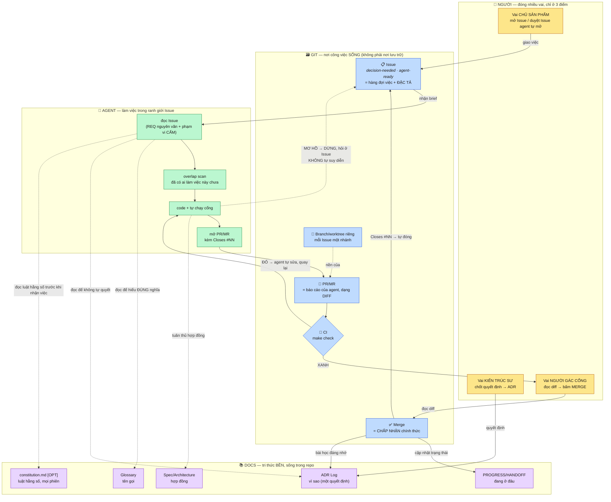
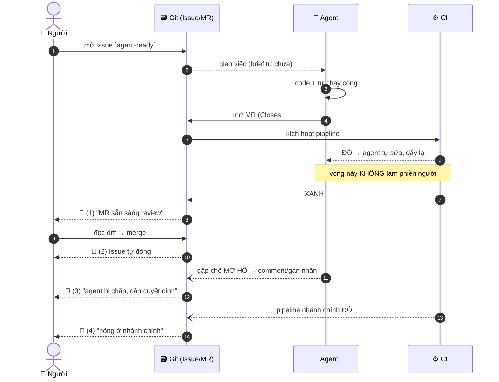

# GIT-FLOW.md — Dùng git làm hệ quản lý tài liệu & công việc (companion của CLAUDE.md)

> **File này là gì:** phần mở rộng **[OPT]** của `CLAUDE.md` — chỉ đọc file này khi project đã chọn
> phương án O7-A (git làm hệ quản lý việc, xem §11 trong `CLAUDE.md`). Tách riêng ra khỏi CLAUDE.md để
> agent không phải tải toàn bộ luồng git mỗi phiên nếu project không dùng tới.
>
> **File này PHỤ THUỘC `CLAUDE.md`:** mọi tham chiếu `§1`–`§10`, `§12` trong file này trỏ ngược về
> `CLAUDE.md` (bảy luật bất di bất dịch, cách chọn quy mô, Tier 0...). Đọc `CLAUDE.md` trước.
>
> **Mục lục:** §11b Git làm hệ quản lý tài liệu & việc (constitution.md · quy ước nhánh `agent/*` ·
> run record · tách SPEC/PLAN) · §11c Hệ sinh thái nhiều repo (monorepo vs polyrepo · hub repo · ID cấp
> ECO · CI dùng chung).

---

## 11b. [OPT] Dùng chính GIT làm hệ quản lý tài liệu & công việc

Phương án O7-A đầy đủ: **Issue = kho TODO · MR/PR = đơn vị review · merge = chấp nhận · CI = cổng máy.**
Đây là cách bỏ được các file trạng thái tự viết (`ISSUES.md`, bảng TODO thủ công) — trạng thái sống ở
nơi vốn đã có vòng đời (mở → gán → đóng), thay vì ở markdown phải nhớ cập nhật bằng tay.

**Điều kiện đảo sang O7-A:** ≥2 agent chạy đồng thời trên cùng repo, đo độc lập với số người vận hành
(`CLAUDE.md` §11, ngay dưới bảng O). Cơ chế: N agent cùng ghi vào một file `§TODO` tạo xung đột merge và
không agent nào thấy agent khác đang làm gì; N agent mỗi con một Issue + worktree/branch
(`agent/<issue-id>-<slug>`, xem dưới) + một PR cô lập việc theo agent — `git branch --list 'agent/*'`
liệt kê đúng ai đang làm gì tại mọi thời điểm. Một người + một agent tại một thời điểm không cần O7-A;
§TODO trong text (O7-B) đủ.

### Toàn cảnh: git trở thành **mặt bàn điều hành** cho cả người lẫn agent

Mô hình dưới đây **quan sát được ở một project có thật** đang chạy theo cách này (một người đóng cả ba
vai chủ sản phẩm / kiến trúc sư / người gác cổng, phần lớn code do agent AI viết). Đặc trưng của nó:
**con người không giao việc bằng chat, mà giao bằng Issue; agent không báo cáo bằng lời, mà báo cáo
bằng PR/MR; và cái gật đầu cuối cùng vẫn là của con người, tại nút merge.**



**Đọc sơ đồ này ra bốn ý:**
1. **Người chỉ chạm 3 điểm** (mở việc · chốt quyết định · merge) — phần còn lại là agent + máy. Đó là
   cách một người đóng được nhiều vai mà không vỡ.
2. **Issue là ĐẶC TẢ, không phải lời nhắc.** Đây là lợi ích lớn nhất khi làm với AI: viết Issue buộc
   người phải chốt phạm vi **trước khi** agent bắt đầu; agent nhận một brief tự chứa; mục "KHÔNG được
   đụng vào" giới hạn bán kính thiệt hại.
3. **Mũi tên `MƠ HỒ → DỪNG, hỏi ở Issue`** là thứ giữ cho mô hình không trôi: agent gặp chỗ chưa rõ thì
   quay lại Issue, không tự quyết. Không có mũi tên này thì Issue chỉ là hình thức.
4. **Docs không nằm trong vòng lặp thực thi — chúng là thứ vòng lặp ĐỌC và GHI vào.** Agent đọc
   Glossary/ADR để hiểu đúng nghĩa; merge ghi ngược lại trạng thái + bài học.

### `constitution.md` — [OPT] tầng luật riêng cho agent, tách khỏi ADR Log

ADR trả lời **"vì sao một quyết định cụ thể"** — gắn với bối cảnh, có thể Superseded (L4). Nhưng có một
loại luật khác hẳn: **hằng số áp cho MỌI phiên agent, không gắn bối cảnh nào** — quy ước code style bắt
buộc, danh sách file/thư mục **cấm đụng toàn cục** (khác "phạm vi cấm" của riêng một Issue), lệnh luôn
phải chạy trước khi mở PR. Nhét loại luật này vào ADR thì mỗi ADR mới lại phải nhắc lại; nhét vào Issue
thì lặp N lần. Một file `constitution.md` cạnh Tier 0, agent đọc nó y như đọc Glossary/ADR (thêm một ô
D5 vào subgraph DOCS ở trên), sửa qua PR như tài liệu thường (Loại 1/2 ở L4 — bổ sung/sửa lỗi, không cần
ADR trừ khi đảo ngược một luật đã có).

**Khi nào cần [TRIGGER]:** agent bắt đầu **lặp lại cùng một lỗi phạm vi/style ở nhiều Issue khác nhau** —
dấu hiệu luật đó thuộc về mọi phiên, không thuộc về một quyết định. **Chưa cần:** ADR nền tảng (L1) đang
đủ, ít agent-session, project mới ở mức S.

### Người được ĐÁNH THỨC lúc nào — cơ chế thông báo

Điểm tinh tế: người **không ngồi canh** agent. Nền tảng git đã có sẵn cơ chế báo; việc cần làm là bố trí
để nó chỉ kêu ở đúng 4 thời điểm — nhiều hơn thì bị nhiễu, ít hơn thì mất kiểm soát.



| # | Đánh thức khi | Vì sao đáng làm phiền |
|---|---|---|
| 1 | MR xanh, chờ merge | Đây là điểm người phải quyết — không ai thay được |
| 2 | Issue tự đóng | Xác nhận vòng đã khép, không cần theo dõi tay |
| 3 | **Agent bị chặn / gặp chỗ mơ hồ** | Quan trọng nhất: thà bị đánh thức còn hơn để agent tự suy diễn |
| 4 | Pipeline nhánh chính đỏ | Hỏng thứ đang chạy — khẩn |

★ **KHÔNG** báo khi: agent đang code · CI đỏ ở nhánh feature (agent tự sửa) · mỗi commit. Báo mọi thứ =
người tắt thông báo = mất luôn cả 4 cái quan trọng.

### Điều kiện tiên quyết — làm SAI thứ tự là tự chặn đường
> **`make check` chạy được ở máy → CI chạy được `make check` → RỒI MỚI khoá nhánh + bắt buộc MR.**

Áp nghi lễ MR khi CI chưa chạy thì "merge = đã qua test" chỉ là lời tuyên bố — đúng thứ L5 cấm, và tệ
hơn không áp vì nó tạo cảm giác an toàn giả.

### Kích hoạt O7-A giữa chừng một project đang chạy O7-B

Áp dụng khi project đã có nội dung thật ở O7-B (roadmap `§TODO` đang chứa việc đang mở, không phải file
rỗng) và vừa đạt điều kiện đảo (≥2 agent chạy đồng thời, `CLAUDE.md` §11). Thứ tự, không đảo bước:

1. **Kiểm Issue tracker sạch trước khi chuyển:** `gh issue list --state all -R <owner>/<repo>`. Có Issue
   cũ đang mở từ trước ⇒ xử lý/đóng trước, tránh nhầm giữa "đã có sẵn từ khi khác" và "mới mở do chuyển
   đổi lần này".
2. **Ghi quyết định bằng một ADR** (`ADR-<PROJ>-NNN`, hoặc `ADR-ECO-NNN` nếu ảnh hưởng ≥2 repo, §11c) —
   Nygard, liệt kê rõ phương án bị loại và vì sao (không chỉ phương án được chọn).
3. **Đảo O2 cùng lúc nếu `adr-log.md` đang là một file** — cùng nguyên nhân concurrency, không phải hai
   quyết định độc lập. Tách thành `adr-log/`, một file/ADR (tên `ADR-<PROJ>-NNN-<slug>.md`, ID là định
   danh thật theo L3, slug chỉ để lướt thư mục) + một `README.md` làm index. Sau khi tách: `grep -rn
   "adr-log\.md"` trên toàn repo, sửa **mọi** file trỏ tới đường dẫn cũ — không chỉ file gọi trực tiếp.
4. **Dựng scaffolding trước khi mở Issue đầu tiên:** `.github/ISSUE_TEMPLATE/{agent-ready,decision-
   needed}.yml` + `PULL_REQUEST_TEMPLATE.md` (mẫu ở `templates/`/`.github/` cạnh file này). Tạo label
   `agent-ready`/`decision-needed` nếu repo chưa có (`gh label create`) — `gh issue create --label` báo
   lỗi nếu label chưa tồn tại.
5. **Migrate JIT (just-in-time), không dump toàn bộ backlog.** Một mục `§TODO` chỉ được viết thành Issue
   thật khi đủ 5 mục brief tự chứa (§7.3-tương-đương của `AGENT.md`) **và** sắp được cầm lên làm — không
   mở Issue thô hàng loạt trước cho cả backlog (Issue là ĐẶC TẢ, viết TODO nguyên văn vào Issue không đạt
   chuẩn đó). `roadmap.md`/`§TODO` cũ đổi vai trò thành backlog + sổ lịch sử: mục đã đóng trước ngày
   chuyển giữ nguyên làm bằng chứng, không migrate hồi tố.
6. **Seed 1–2 Issue thật trước khi coi bước này xong.** Dựng khung (bước 4) mà chưa mở Issue nào là chưa
   chứng minh luồng chạy được — `gh issue create` thật, không phải bản nháp trong đầu.
7. **Sau khi seed, quét lại con trỏ cũ.** Mọi chỗ trong docs từng trỏ vào mục `§TODO` vừa migrate phải
   đổi thành link Issue thật (`→ Issue #N`), không giữ cả hai cùng là "nguồn việc-đang-mở" (L2). Đồng
   thời rà các số liệu liên quan đã đổi cùng thời điểm nhưng nằm ở file khác (vd một bảng đếm số test-đỏ
   ở file A không tự cập nhật khi test được sửa ở file B) — quét bằng cách tìm mọi chỗ trích dẫn cùng
   con số/đường dẫn vừa đổi, không chỉ sửa nơi trực tiếp liên quan đến thay đổi.

### Chia việc giữa Issue và Docs — giữ L2 (một loại sự thật, một nhà)
Thêm Issue mà vẫn giữ bảng TODO trong docs = **hai nguồn sự thật**. Chia theo **tuổi thọ thông tin**:

| Loại thông tin | Nhà | Vì sao |
|---|---|---|
| Việc **đang mở**, trạng thái, ai làm, chặn bởi gì | **Issue** | Vòng đời ngắn, có sẵn cơ chế đóng/gán/lọc |
| **Vì sao** quyết định thế, bất biến, bài học, cơ chế | **Docs (ADR/algorithm/testing)** | Đáng đọc lại sau 6 tháng; Issue đóng rồi không ai lục |
| Lịch sử "đã sửa gì" | **`git log` + MR đã merge** | Đừng chép lại vào docs |

Nối hai chiều: Issue trỏ mục doc liên quan; doc ghi bài học kèm số Issue. Mỗi loại vẫn đúng một nhà.

### [OPT] Quy ước tên nhánh cho agent — `agent/<issue-id>-<slug>`

Ví dụ: `agent/42-fix-quota-closure-bug`. Tiền tố `agent/` (hoặc `ai/`, miễn nhất quán) làm hai việc:
báo cho reviewer **trước khi mở diff** đây là code máy viết, và cho phép áp **branch-protection riêng**
cho nhánh agent (vd bắt buộc CI xanh, cấm force-push) khác với nhánh người. Lợi ích đo được:
`git branch --list 'agent/*'` liệt kê đúng và chỉ đúng mọi nhánh agent đang mở.

★ Cộng đồng đang chia phe về việc có nên đánh dấu **từng dòng** do agent viết trong `git blame` hay
không — phe cho rằng ai commit thì người đó chịu trách nhiệm, không cần nhãn theo dòng. Quy ước **theo
nhánh** ở trên tránh được tranh cãi này: nhãn nằm ở cấp quy trình (branch/PR), không nằm ở cấp dòng code.

### Bốn cổng, theo thứ tự tăng dần chi phí

| Cổng | Nội dung | Chi phí | Đáng làm khi |
|---|---|---|---|
| G1 **`make check`** | lint · typecheck · **import-linter** · test/smoke, gom một lệnh | thấp | luôn luôn |
| G2 **CI chạy G1** | mỗi push/MR | thấp (nếu có runner) | luôn luôn |
| G3 **Nhánh được bảo vệ** | cấm push thẳng; merge khi pipeline xanh | trung bình | sau khi G2 ổn định |
| G4 **Người duyệt** | approvals/CODEOWNERS, cấm tự merge | cao | **[TRIGGER]** ≥2 người thật |

★ Một mình thì G4 là **tự-review**, không phải review độc lập — giữ *checklist* (nó bắt được lỗi thật,
kể cả lỗi tự mâu thuẫn trong header tài liệu), nhưng đừng gọi tên sai bản chất.

### Hai mẫu Issue đủ dùng
- **`decision-needed`** → đầu vào của một ADR. Bắt buộc: bối cảnh · các phương án · thứ **KHÔNG** thuộc
  phạm vi quyết định này. Đóng khi ADR merge.
- **`agent-ready`** (Story) → việc code được ngay. Tách **hai khối bên trong Issue**, vì độ bất biến khác
  nhau (áp dụng khi Issue đủ phức tạp để "cách làm" có thể sai dù "yêu cầu" đúng — Issue nhỏ giữ gộp
  như cũ):
  - **SPEC (bất biến trong phiên):** yêu cầu **trích nguyên văn** từ tài liệu nguồn (không diễn giải lại
    — paraphrase là nơi hiểu sai chui vào) · vị trí file · tiêu chí chấp nhận · **phạm vi KHÔNG được
    đụng** · **Blocked by**.
  - **PLAN (agent điền, SỬA ĐƯỢC giữa chừng):** cách làm dự kiến · thứ tự bước · file dự kiến đụng tới.
    Cách làm sai thì sửa PLAN và ghi lại vì sao; **không** đóng Issue viết lại từ đầu, vì SPEC vẫn đúng.

★ **Overlap scan trước khi code** (2 phút, thủ công): liệt kê 2–3 Issue gần nhất cùng nhóm, xem có ai
đang làm cùng một bài toán không. *Tiền lệ thật:* hai Story song song viết **hai hàm độc lập cho cùng
một việc**, chỉ lộ ra sau khi cả hai đã merge.

### [OPT] Run record trong PR/MR — nhật ký phiên chạy của agent

Mô tả PR/MR do agent mở nên có thêm, ngoài `Closes #NN`: **quyền công cụ** agent được cấp trong phiên đó
(đọc/ghi file, network, shell) · **model + version** đã dùng · **ngoại lệ chính sách** nếu có (vd được
phép bỏ qua một rule lint cụ thể). Không phải để trang trí — khi có sự cố, câu cần trả lời là *"agent
được phép làm gì lúc đó"*, không phải chỉ *"agent đã làm gì"* (cái sau đã có sẵn trong diff).

**Khi nào cần [TRIGGER]:** agent có quyền **thực thi thật** (chạy shell, gọi network, không chỉ sửa
file tĩnh). **Chưa cần:** agent chỉ có quyền đọc/sửa file trong sandbox, không có quyền thực thi ngoài
`make check`.

### Nếu nền là GitLab (không phải GitHub) — bảng quy đổi
| GitHub | GitLab | Lưu ý |
|---|---|---|
| Pull Request | **Merge Request** | `Closes #NN` vẫn tự đóng Issue |
| Discussions (độc lập) | **không có** | Dùng Issue gắn nhãn `discussion` |
| Issue Forms (`.yml`, có trường cấu trúc) | `.gitlab/issue_templates/*.md` | Chỉ markdown — không có trường bắt buộc |
| PR template | `.gitlab/merge_request_templates/*.md` | |
| Actions | `.gitlab-ci.yml` | **Kiểm có runner trước** (Settings → CI/CD → Runners) |
| `gh` CLI | `glab` CLI | Không có sẵn thì agent không thao tác được Issue/MR |
| Branch protection + required review | Protected branches (có ở bản free); **approval rules/CODEOWNERS ép buộc thường là bản trả phí** | Kiểm tier trước khi thiết kế quy trình dựa vào chúng |

### Bảng quyết định điển hình khi dựng cổng lần đầu (làm gì · quyết gì · vì sao)

Đây là **các quyết định đã thực sự phải ra** khi lắp bộ này vào một hệ nhiều repo, kèm lý do. Ghi lại để
lần sau không phải nghĩ lại từ đầu. Bối cảnh gốc: 3 repo Python cùng một nhóm, chạy bằng
`docker compose`, GitLab tự dựng (self-hosted).

| Quyết định | Chọn gì | Vì sao |
|---|---|---|
| **Script hay Makefile** | một `scripts/check.sh` | Máy dev/run **không có `make`**; cài thêm gói hệ thống là đổi hạ tầng, không làm lặng lẽ. Vai trò y hệt; nếu sau này có `make` thì `check: ; ./scripts/check.sh` |
| **Runner: cài bằng apt hay chạy bằng docker** | **docker** (ảnh runner chính thức) | Gỡ sạch bằng `compose down` + xoá volume, không để lại systemd unit hay binary lạc. Máy vốn đã docker-first |
| **Runner đặt ở thư mục nào** | cùng chỗ với **hạ tầng dùng chung sẵn có** (vd thư mục đang chứa stack observability) | Đi theo tiền lệ đã có trong repo thay vì mở quy ước mới; hạ tầng dùng chung cả nhóm repo thì để một chỗ |
| **Cấp đăng ký runner** | **cấp GROUP**, không phải từng project | Một runner phục vụ mọi repo trong nhóm, khỏi dựng lại N lần |
| **CI chạy gì** | gọi **đúng script mà người chạy ở máy** | Một nơi định nghĩa, hai nơi gọi. Viết lại logic kiểm trong YAML là nguồn kinh điển của "máy tôi xanh mà CI đỏ" |
| **CI chạy tầng nào** | **chỉ tầng TĨNH** | Máy CI không có hạ tầng của app (DB, message bus, dịch vụ mô hình). Smoke vẫn chạy ở máy dev qua `--smoke`. Công cụ kiểm tĩnh chỉ đọc AST ⇒ chạy được trong image trống |
| **Bật bao nhiêu luật lint** | **chỉ nhóm bắt lỗi thật** (lỗi cú pháp · so sánh sai · dùng tên chưa định nghĩa) | Bật cả bộ ra **337 lỗi**, phần lớn là style ⇒ cổng đỏ-sẵn → người ta tắt đi → mất luôn tác dụng. Nhóm hẹp đang xanh **và** bắt được lỗi thật (xem ngay dưới) |
| **Bí mật (token) đi đường nào** | qua **tệp**, không qua chat/tham số dòng lệnh | Chat và lịch sử shell đều lưu lại vĩnh viễn. Script không in token ra, và bắt xoá tệp ngay sau khi dùng |

★**Cổng vừa dựng đã bắt được bug thật ngay hôm đầu** — đây là lý lẽ mạnh nhất cho việc dựng cổng.
Luật "dùng tên chưa định nghĩa" chỉ ra **4 chỗ** trong một tệp xử lý API dựng **closure ôm biến của khối
`except`**:

```python
except QuotaExceeded as exc:
    def _deny():                  # ✗ closure chạy LÚC STREAM, tức là SAU khi khối except kết thúc
        return f"hết quota: {exc.used}/{exc.limit}"     # NameError
```

Python **xoá tên đó** khi ra khỏi khối (`del exc` ngầm), mà closure chỉ chạy **lúc stream** — tức là sau
đó. Hậu quả: người dùng **hết quota** nhận `NameError` thay vì thông báo hướng dẫn. Cách vá: **bắt giá
trị ra biến thường ngay trong khối** (`used, limit = exc.used, exc.limit`) rồi để closure ôm biến đó.
Đã **tái hiện bằng một đoạn 8 dòng trước khi vá** (đừng sửa theo suy đoán). Bug này sống trong code đã
chạy nhiều tháng, mọi bài test đều xanh, không ai thấy.

★**Phân biệt lỗi thật với lỗi hình thức** — cùng một mã lỗi nhưng khác hẳn về hậu quả: một chỗ thứ năm
dùng kiểu chưa import (`List[str]`) trong **annotation của biến cục bộ** **không** gây lỗi runtime, vì
Python **không đánh giá** annotation của biến cục bộ (khác annotation ở cấp module/class — đã kiểm bằng
thực nghiệm, không đoán). Vẫn sửa, nhưng **đừng báo cáo hai thứ đó cùng một giọng**: gộp chúng làm một
sẽ khiến người đọc hoặc hoảng thừa, hoặc quen tay bỏ qua cả hai.

**Hai lỗi CHÍNH CÁI CỔNG tự gây ra — dựng cổng cũng phải kiểm cổng:**
1. **Cổng tự tạo rác rồi tự vấp.** `compileall` rải `__pycache__` khắp cây mã; bước tìm module smoke
   dùng `grep -rln` khớp trúng docstring **nằm trong `.pyc`** → sinh 10 "module" ma
   (`src.services.__pycache__.reconcile.cpython-312.pyc`) → cổng **đỏ oan**. Vá hai đầu: đẩy bytecode
   ra ngoài repo bằng `PYTHONPYCACHEPREFIX`, và `grep --include='*.py'`.
2. **Thông báo có TÁC DỤNG PHỤ.** Dòng nhắc "cài bằng `pip install ruff`" viết trong chuỗi **nháy
   kép** ⇒ bash coi backtick là **thay thế lệnh** và **chạy thật**, cài ruff vào môi trường máy khi lẽ
   ra chỉ in một câu chữ. Một cổng kiểm tra **tuyệt đối không được đổi máy đang kiểm**. Dùng nháy đơn.

★Và lỗi thứ ba, của người dùng cổng chứ không phải của cổng: nối `./check.sh | tail -2 && git commit`
— **exit code của pipeline là của lệnh CUỐI** (`tail`, luôn 0) ⇒ commit vẫn chạy dù cổng ĐỎ. Muốn
chặn thật thì đừng bọc cổng trong pipeline, hoặc bật `set -o pipefail`.

### Khi KHÔNG có runner / KHÔNG đủ quyền — vẫn lấy được phần lớn giá trị

**Cách kiểm "có runner không" mà không cần quyền gì:** push một `.gitlab-ci.yml` tối giản rồi nhìn
Pipelines. Job mang nhãn **`stuck`** + `Pending` ⇒ **không có runner** (job tạo ra nhưng không ai nhận).
Đây là kiểm nghiệm thực chứng — hơn hẳn việc đoán qua menu.

★**Một trường hợp có thật đáng nhớ:** trong lịch sử pipeline của repo có một job hỏng từ **hai tháng
trước**, ai cũng tưởng là lỗi code nên không ai đụng tới. Đọc kỹ thì nó cũng chỉ mang nhãn `stuck` rồi
hết giờ chờ — tức là **chưa từng có runner nào**, code chưa hề được chạy lấy một lần. Bài học: *nhãn
trạng thái của pipeline là dữ liệu chẩn đoán, đọc nó trước khi kết luận về code.*

**Cách biết mình có quyền dựng runner không:** trong GitLab, mục **`Settings`** ở sidebar **chỉ hiện với
Maintainer/Owner**. Sidebar đi thẳng từ `Analyze` → `Help` mà không có `Settings` ⇒ đang là Developer.
Chắc chắn hơn thì mở thẳng `/-/settings/ci_cd` — 404/403 là câu trả lời.

**Phương án không cần quyền: git hook `pre-push`** gọi đúng `scripts/check.sh`.

| | CI (có runner) | Hook `pre-push` |
|---|---|---|
| Bản chất | **cưỡng chế** | **kỷ luật** |
| Bỏ qua được? | không (nếu khoá nhánh) | có — `--no-verify` |
| Người mới clone | tự động có | **phải tự chạy** `install-hooks.sh` (git không version `.git/hooks`) |
| Chạy tầng nào | tĩnh | tĩnh (**cố ý**: push chậm ⇒ người ta `--no-verify` cho xong, cổng mất tác dụng) |

★Nói rõ giới hạn **ngay trong file hook**. Một cổng bị hiểu nhầm là cưỡng chế trong khi thực ra bỏ qua
được thì còn nguy hơn không có cổng.

### Chi phí thật, nói trước
Thay đổi đắt nhất **không phải công cụ** mà là **thói quen nhánh**: từ nhánh cá nhân dài hạn
(`dev-<tên>`, push thẳng) sang nhánh feature ngắn cắt từ mainline. Chưa sẵn sàng đổi thói quen đó thì
làm G1+G2 trước — đã lấy được phần lớn giá trị mà chưa phải đổi cách làm việc.

---

## 11c. [OPT] Hệ sinh thái nhiều repo — khi §11b phải trải ra trên >1 repo

★ **Cảnh báo mức bằng chứng (theo L6 ở CLAUDE.md):** khác với §11b — vốn mô tả một hệ thống đang chạy
thật — mục §11c này là **tổng hợp từ khảo sát thực hành ngành + suy luận logic**, chưa có xác nhận đã
chạy đúng nguyên trạng trong một project cụ thể. Áp dụng thật thì tự thêm dòng "đã verify ngày <DATE>"
theo L5, đừng đọc nó với cùng mức tin cậy như phần quan sát được.


**[TRIGGER] kích hoạt mục này khi:** ≥2 trong số các repo **thật sự phụ thuộc lẫn nhau** — đổi API/schema
ở repo này thường kéo theo việc phải đổi ở repo kia. **Chưa cần** nếu 3 project chỉ tình cờ cùng một
người quản lý nhưng độc lập hoàn toàn (không gọi nhau, không chia schema) — lúc đó áp §11b riêng cho
từng repo là đủ, đừng phức tạp hoá.

### Bước 0 — quyết định monorepo hay polyrepo, và **ghi lại như một ADR**

Đây không phải câu hỏi công cụ, mà là đánh đổi thật, và nên trace được như mọi quyết định khác (L1–L4):

| | Monorepo (gộp 3 vào 1 repo) | Polyrepo (giữ 3 repo riêng) |
|---|---|---|
| Agent thấy được gì | Toàn bộ 3 project trong một context — sửa xuyên repo trong **một PR** | Agent ở repo A không thấy ai đang tiêu thụ code nó vừa sửa; đổi xuyên repo cần điều phối thêm |
| Chi phí hạ tầng | Phải đầu tư liên tục (build cache, CI phân vùng theo thư mục) theo kịp quy mô, không thì PR review time giãn ra không đoán được | Mỗi repo tự chủ CI/release riêng, chi phí hạ tầng thấp hơn nhưng đổi xuyên repo cần N PR đồng bộ |
| Hợp khi | 3 project phụ thuộc chéo nhiều, đổi thường kéo cả 3, bạn là người/agent duy nhất vận hành | 3 project release lệch nhịp nhau, sau này có thể tách quyền truy cập/đội ngũ riêng cho từng cái |
| Không hợp khi | Bạn chưa sẵn sàng đầu tư tooling build/CI phân vùng — monorepo không tự nhiên rẻ | 3 project đổi API cùng lúc thường xuyên — chi phí điều phối N-PR ăn hết lợi ích tách repo |

★ Mặc định đề xuất cho "một người + agent, 3 project phụ thuộc chéo, tốc độ cao": **monorepo** — agent
sửa xuyên 3 project trong một PR, một `make check` chạy được cả 3. Đổi ý sau này (tách ra) vẫn dễ hơn
chiều ngược lại.

Nếu chọn polyrepo, phần dưới đây áp dụng.

### Một repo "hub" giữ Tier 0 — các repo code chỉ LINK, không copy

Vi phạm L2 điển hình khi có nhiều repo: mỗi repo tự có một bản `glossary.md`/`adr-log.md` riêng, rồi
lệch nhau dần. Xử lý: tạo một repo thứ 4 (`<eco>-docs`), chuyển toàn bộ Tier 0 — `glossary.md`,
`adr-log.md`, `context-map.md`, `constitution.md` (§11b), `README.md` (Doc Index) — về đó. Mỗi repo code
chỉ giữ một file mỏng trỏ sang:

```markdown
<!-- docs/POINTER.md trong từng repo con -->
Tài liệu nền tảng của hệ sinh thái sống ở <eco>-docs, KHÔNG lặp lại ở đây:
- Glossary: <link> · ADR Log: <link> · Context Map: <link> · Constitution: <link>
Tài liệu CHỈ RIÊNG repo này (algorithm.md, interface.md...) vẫn ở docs/ như bình thường.
```

**Context Map đổi vai trò:** trước đây (1 repo) nó vẽ ranh giới với thế giới ngoài; giờ nó vẽ **ranh
giới giữa 3 project của chính bạn** — cái gì thuộc repo nào, ai gọi ai, qua hợp đồng nào (Interface
Control Document — Tier 2/3, không còn là tuỳ chọn ở mức M, xem §4).

### ID cấp hệ sinh thái — thêm một tầng, không thay tầng cũ

`GLOSS-<PROJ>-001` chỉ có nghĩa trong phạm vi 1 project. Thêm tầng `GLOSS-ECO-001` cho thuật ngữ **dùng
chung cả 3** (tên miền nghiệp vụ, thực thể xuyên repo); giữ nguyên `GLOSS-<PROJ>-001` cho thuật ngữ chỉ
riêng 1 repo. Cùng quy tắc cho `ADR-ECO-*` (quyết định ảnh hưởng ≥2 repo, vd chọn giao thức giữa các
service) so với `ADR-<PROJ>-*` (quyết định nội bộ 1 repo).

### Issue liên-repo — `Closes owner/repo#N` phải viết rõ, không tự nhiên hoạt động

`Closes #NN` trong PR chỉ tự đóng Issue **cùng repo**. GitHub hỗ trợ `Closes owner/repo-khac#12` để đóng
Issue ở repo khác, nhưng nếu không quy ước rõ trong template `agent-ready`, Issue liên-repo sẽ bị quên.
Thêm một trường bắt buộc vào SPEC (§11b) khi việc động tới >1 repo: **"Repo liên quan"** — liệt kê hết,
mỗi repo một Issue riêng, trỏ nhau bằng `Blocked by owner/repo#N` / `Blocks owner/repo#N`.

### CI dùng chung — reusable workflow, không copy-paste YAML

Tương đương "runner cấp GROUP" đã nói cho GitLab (§11b): trên GitHub, đặt `scripts/check.sh` (G1) và
workflow gốc trong repo hub hoặc một repo `.github` cấp tổ chức, 3 repo con gọi lại bằng:
```yaml
jobs:
  check:
    uses: <org>/<eco>-docs/.github/workflows/check.yml@main
```
Một nơi định nghĩa cổng, ba nơi gọi — đúng nguyên tắc "CI chạy đúng script mà người chạy ở máy" (bảng
quyết định ở §11b), chỉ mở rộng từ 1 repo ra N repo.

### Khi nào tính lại quy mô S→M

Có hệ sinh thái ≥2 repo phụ thuộc chéo là điều kiện "domain thứ 2 sắp lên" trong bảng §2 đã xảy ra thật
— tự động đẩy quy mô tài liệu từ **S lên M**: Tier 0 tách file hẳn (không gộp như mức S nữa), PR review
bắt buộc cho `docs/**` ở repo hub, Doc Index có trạng thái Draft/In Review/Approved.

---

