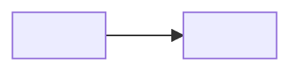

# Context Map — <PROJ>

> **Mã:** <PROJ>-DOC-03 | **Phiên bản:** 0.1.0 | **Ngày:** <YYYY-MM-DD> | **Trạng thái:** 🟡 Draft
> **Depends On:** [glossary.md](glossary.md) · [adr-log.md](adr-log.md) — viết sau cả hai, trích dẫn ADR
> để giải thích VÌ SAO ranh giới nằm ở đó, đừng vẽ theo cảm tính.
> **Nguồn:** <tài liệu/khảo sát đã đọc TOÀN VĂN>

> ⏸ Nếu project chỉ có 1 service/1 repo và chưa có hệ thống ngoài đáng kể để vẽ ranh giới: **gộp mục
> này vào file tổng quan** (vd `project-overall.md`, xem `CLAUDE.md` §4 bảng nén mức S) thay vì để file
> rỗng — gộp file hợp lệ, bỏ TẦNG mới là mất mát.

## 1. Ranh giới hệ thống — cái gì TRONG, cái gì NGOÀI

<Sơ đồ Mermaid hoặc bảng: các Bounded Context, ai sở hữu gì, ai KHÔNG làm gì.>

## 2. Bảng "Sở hữu / KHÔNG làm"

| Context | Sở hữu | KHÔNG làm |
|---|---|---|
| <A> | <gì> | <gì — nói rõ ranh giới âm, không chỉ ranh giới dương> |

## 3. Bất biến khi tổ hợp (nếu có >1 context)

- <Bất biến 1 — vd "chỉ một nguồn sự thật cho X">
- <Bất biến 2>

## Đọc tiếp
- [adr-log.md](adr-log.md) — quyết định đứng sau ranh giới này.
